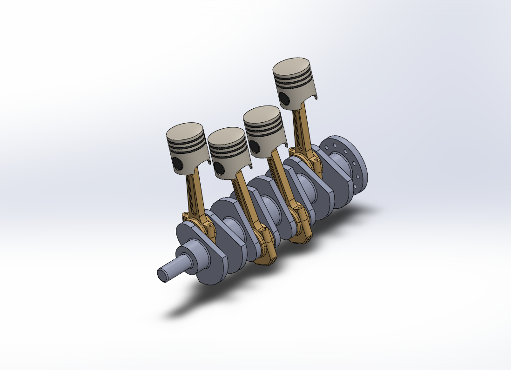

# 3D Model of a Four-Cylinder Internal Combustion Engine

## Project Description

This repository contains the complete SolidWorks 3D model of a four-cylinder internal combustion engine. The project was undertaken to practice advanced mechanical design, part modeling, and complex assembly creation. Every major component, from the engine block and crankshaft to the pistons and valvetrain, has been modeled individually and integrated into a final, detailed assembly.

## Key Features & Components

- **Engine Block:** Modeled with cylinders, coolant passages, and mounting points.
- **Crankshaft & Piston Assembly:** Includes a fully modeled crankshaft, connecting rods, pistons, and piston rings.
- **Valvetrain:** Features camshafts, valves, springs, and rockers.
- **Detailed Assembly:** All parts are fully constrained in a final assembly, demonstrating a complete and functional mechanical system.
- **Parametric Design:** Key dimensions were designed parametrically to allow for potential future modifications.

## Renders & Visuals

Here is another view showing the internal components:

## Tools Used

- **CAD Software:** SolidWorks 2022
- **Rendering:** SolidWorks PhotoView 360

---

*This project is for portfolio purposes to demonstrate mechanical design and CAD skills.*
